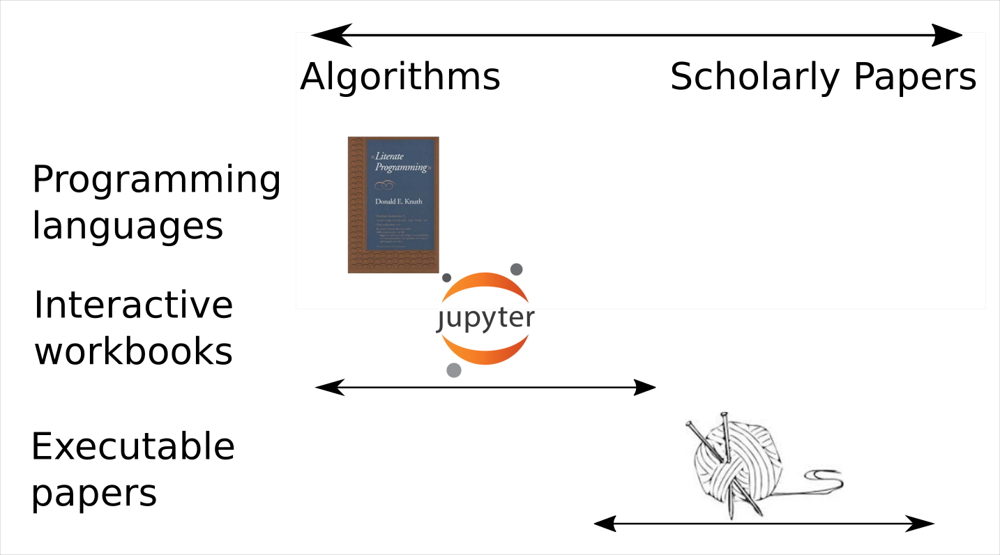

## The problem

[](Talk aim: To understand why writing a reproducible paper is a good thing, and that it follows naturally from containerising one's research.)

- The scholarly publication process is slow and lumpy
- But scientific knowledge is incremental
	* And there are always more questions than there's time to answer
- How can Docker and reproducible research help?

[](Pipeline makes it easier to ask new questions of your data.)

## Outline

- Background to reproducible research
- Where Docker fits into this
- Benefits and challenges 

## Reproducible Research


<h6>Image:  <a href="//en.wikipedia.org/wiki/File:Literate_Programming_book_cover.jpg">Wikipedia</a></h6>


[](1984.  Very much focussed on _programming_.  Literate data analysis may be a better name for what we're trying to do. ) 
---


## {data-transition="none"}


## {data-transition="none"}


## {data-transition="none"}


## {data-transition="none"}



[](Jupyter notebooks look like Jupyter notebooks - we're making something that looks like a regular paper.  But can make something that looks like a Notebook)

---

## Reproducible Research in R

- `knitr` allows us to interleave markdown or `LaTeX` with `R` code
	* R session persists throughout document
 
- Can produce something that looks _identical_ to a "normal" paper
	* Paper source needed for reproducibility

[](Fits in well with existing publication practices - provided you can submit in LaTeX)
    	
## {data-transition="concave-out"}


[](Example reproducible paper - loads example data set, does regression, plots results, extracts figure.  Standard LaTeX template, but could use anything. This *is* the paper, built using Travis CI)

## {data-transition="concave-in fade-out"}


[](Paper is produced reproducibly within presentation)

## Reproducible != Reusable

- Reproducibility is a good thing
	* It makes you do things *properly*
	* It lets others check your work
	* It lets others repeat your work
- It doesn't (necessarily) make it easy to _reuse_ or _extend_ your work 

## Docker Pipelines for Reproducible, Reusable Research

- By breaking our analysis pipeline into sections we obtain a
_more flexible_ and modular workflow.
	* makes incremental improvement / extension of the work easier
- Docker facilitates this
- Use a Makefile to handle dependencies between "modules" 
- The manuscript is part of the analysis pipeline
  	* just another "module"

## Example - IDInteraction

- Automate the coding of behaviours
- This is _really_ slow and tedious to do by hand.

 

---


## Docker images
- Each module contains its own Makefile
- Example: object tracking
   
[](Discuss aim of experiment, data source, processing workflow)


## Docker images {data-transition="none"}
- Each module contains its own Makefile
- Example: object tracking
   
[](Discuss aim of experiment, data source, processing workflow)


## Docker images {data-transition="none"}

- Each module contains its own Makefile
- Example: object tracking
   


##


[](Each module is self-contained; can use different versions of libraries, e.g. OpenCV)  

## Top-level Makefile
- Handles dependencies between the Docker image modules
- Calls the final Docker image to produce manuscript

## Extensible papers

- Modularity using Docker makes it easier to extend papers
  * Avoids salami slicing

- Also allows paper to be built anywhere
  * Allows the publisher/reviewers to check manuscript code

- Version control makes it obvious what's been added to the paper &#8594; lighter weight peer review

[](Reduces bottleneck of peer review)

## The paper as software

- Treating the paper as "just another part" of the software development process lets us use:
	* Version control
	* Continuous integration
	* Unit testing


## Recommendations

- Keep intermediate analysis steps
	* Avoids wasted work in slow modules
- Make the Knitr paper runable on native system
  	* Allows interactive writing / analysis
- Test textual assertions with `R` code:

> "The accuracy doubled when we used the new procedure"

```
if(acc.new < 2*acc.old)
	warning("Accuracy assertion failed")
```


## Challenges

- Extra overhead 
  	* Minimised if working reproducibly from the outset
	* Manuscript container could be shared
	* Good "glue" to streamline workflow is important
- Working offline / collaboratively (e.g. Overleaf, Google Drive)


Challenges are minimised if you research reproducibly from the start - all you need is the "glue"


## Benefits

- Each module (Docker image) can be used independently of the others
  - Re-usability _and_ reproducibility
- Can trace each figure in the paper back to its source
- Readers can _fully_ understand methodology
- Paper is self consistent
- Could reshape publication process

## The future of academic research outputs

- Should something like an academic paper be the "standard" research output?
  * Is this better than, e.g. a Jupyter notebook? If so, why?
    - Audience; who reads it and why?
    - Researcher evaluation/assessment; cultural shift, relative (perceived) values of, e.g. notebooks vs journal articles

- It seems likely that academic papers will be the primary means of scientific dissemination / credit for a while

## Conclusions

- Knitr makes writing a reproducible paper within R easy
  	* Complexity comes from leaving R ecosystem
- Docker reduces this complexity and makes the paper extensible
	* Makes the analysis pipeline repurposable
- Extra work minimised if process embedded from the outset


## Bibliography/further reading

* [Gandrud, C. (2013). Reproducible Research with R and R Studio.](https://raw.githubusercontent.com/IDInteraction/dockerworkshop/68621437a9d33e500e29324c5e2a86daca8fd061/.travis.yml)
* [Lowndes, J. S. S., et al  (2017). Our path to better science in less time using open data science tools. Nature Ecology & Evolution, 1(6), 160.](https://doi.org/10.1038/s41559-017-0160)
* [Titus Brown, C. (2017) : Predicting the paper of the future. TechBlog: C, Nature Jobs (Interview with Perkel, J)](http://blogs.nature.com/naturejobs/2017/06/01/techblog-c-titus-brown-predicting-the-paper-of-the-future/)
* [Xie, Y. (2015) Dynamic Documents with R and knitr. 2nd ed. Chapman and Hall/CRC](https://www.crcpress.com/Dynamic-Documents-with-R-and-knitr-Second-Edition/Xie/p/book/9781498716963)

