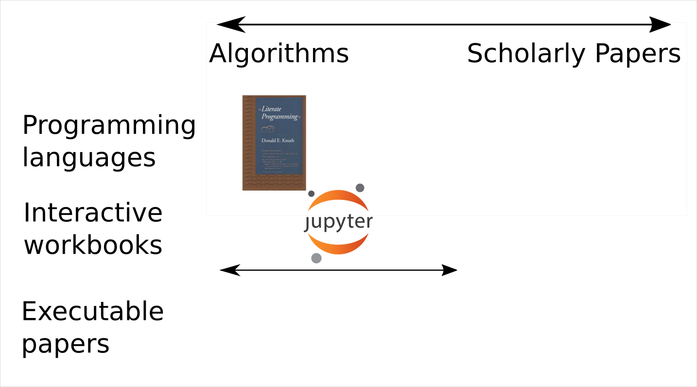

## The problem

[](start with the question, “what’s the one thing I want people to learn, or feel, or do, as a result of hearing this?”. Tim Harford)

[](To understand why writing a reproducible paper is a good thing, and that it follows naturally from containerising one's research.)

- The scholarly publication process is slow and lumpy
- But scientific knowledge is incremental
	* And there are always more questions than there's time to answer
- How can Docker and reproducible research help?

## Outline

- Background to reproducible research
- Where Docker fits into this
- Benefits, challenges and open questions 

## Reproducible Research


<h6>Image:  <a href="//en.wikipedia.org/wiki/File:Literate_Programming_book_cover.jpg">Wikipedia</a></h6>


[](1984.  Very much focussed on _programming_.  Literate data analysis may be a better name for what we're trying to do. ) 
---


---


---


---



[](Jupyter notebooks look like Jupyter notebooks - we're making something that looks like a regular paper)

---

## Reproducible Research in R

- `knitr` allows us to interleave markdown or `LaTeX` with `R` code
	* R session persists throughout document
		- Code chunks can be cached
	* Supports other languages -- but no persistence between chunks
 
  * Can produce something that looks _identical_ to a "normal" paper
    	- Paper source needed for reproducibility
    	

---

```{r, echo=FALSE,  comment=NA}
writeLines(readLines("ExamplePaper.Rnw"))
```

---


## Reproducible != Reusable

- Reproducibility is a good thing
	* It makes you do things *properly*
	* It lets others check your work
	* It lets others repeat your work
- It doesn't (necessarily) make it easy to _reuse_ or _extend_ your work 

## The future shape of academic research outputs

- Should something like an academic paper be the "standard" research output?
  * Is this better than, e.g. a Jupyter notebook? If so, why?
    - Audience; who reads it and why?
    - Researcher evaluation/assessment; cultural shift, relative (perceived) values of, e.g. notebooks vs journal articles
- It seems likely that academic papers will be the primary means of scientific dissemination / credit for a while

## Docker Pipelines for Reproducible, Reusable Research

- By breaking our analysis pipeline into sections we obtain a
_more flexible_ workflow, which makes incremental improvement / extension of the work easier
- Docker facilitates this
- Use a Makefile to handle dependencies between "modules" 
- The manuscript is then just another "module"

## Example

---


---


## Docker images
- Each module contains its own Makefile
- Example: CppMT tracking
  
  
---


  
## Top-level Makefile
- Handles dependencies between the Docker image modules
- Calls the final Docker image to produce manuscript

## Extensible papers

- Modularity using Docker makes it easier to extend papers
- Also allows paper to be built anywhere
  - In principle allows the publisher/reviews to check manuscript _code_.

- Version control makes it obvious what's changed between versions/extensions &#8594; lighter weight peer review


## The paper as software

- Treating the paper as "just another part" of the software development process lets us use:
	* Version control
	* Continuous integration
	* Unit testing


## Tips

- Test textual assertions with `R` code
- Make intermediate files in modules "precious" 
	* Avoids wasted work in slow modules
- Make the Knitr paper runable on native system
  	* Allows interactive writing / analysis

## Challenges

- Extra overhead 
  	* Minimised if working reproducibly from the outset
	* Manuscript container could be shared
	* Good "glue" to streamline workflow is important
- Working on the analysis and manuscript interactively
	* Working offline

Challenges are minimised if you research reproducibly from the start - all you need is the "glue"

## An industrial Fabergé Egg?


<h6><a href=https://doi.org/10.1145/5948.315654 >Bentley, J., Knuth, D., & McIlroy, D. (1986). Programming pearls. Communications of the ACM, 29(6), 471–483. </a></h6>


## Benefits

- Each module (Docker image) can be used independently of the others
  - Re-usability _and_ reproducibility
- Can trace each figure in the paper back to its source
- Can _fully_ understand methodology
- Paper is self consistent
- Could reshape publication process

## Bibliography/further reading

* [Gandrud, C. (2013). Reproducible Research with R and R Studio.](https://raw.githubusercontent.com/IDInteraction/dockerworkshop/68621437a9d33e500e29324c5e2a86daca8fd061/.travis.yml)
* [Lowndes, J. S. S., et al  (2017). Our path to better science in less time using open data science tools. Nature Ecology & Evolution, 1(6), 160.](https://doi.org/10.1038/s41559-017-0160)
* [TechBlog: C. Titus Brown: Predicting the paper of the future, Nature Jobs (2017)](http://blogs.nature.com/naturejobs/2017/06/01/techblog-c-titus-brown-predicting-the-paper-of-the-future/)
* [Xie, Y. (2015) Dynamic Documents with R and knitr. 2nd ed. Chapman and Hall/CRC](https://www.crcpress.com/Dynamic-Documents-with-R-and-knitr-Second-Edition/Xie/p/book/9781498716963)

